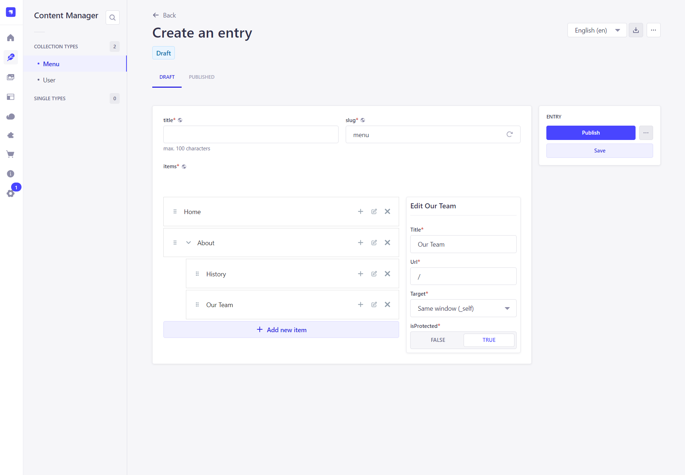
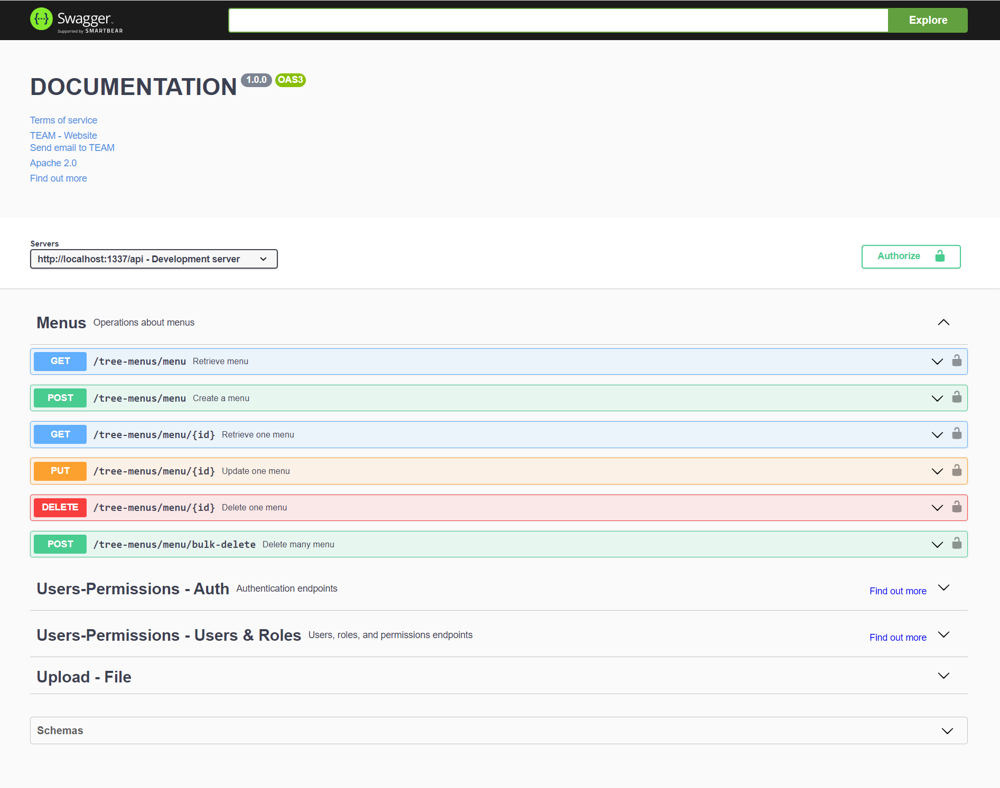
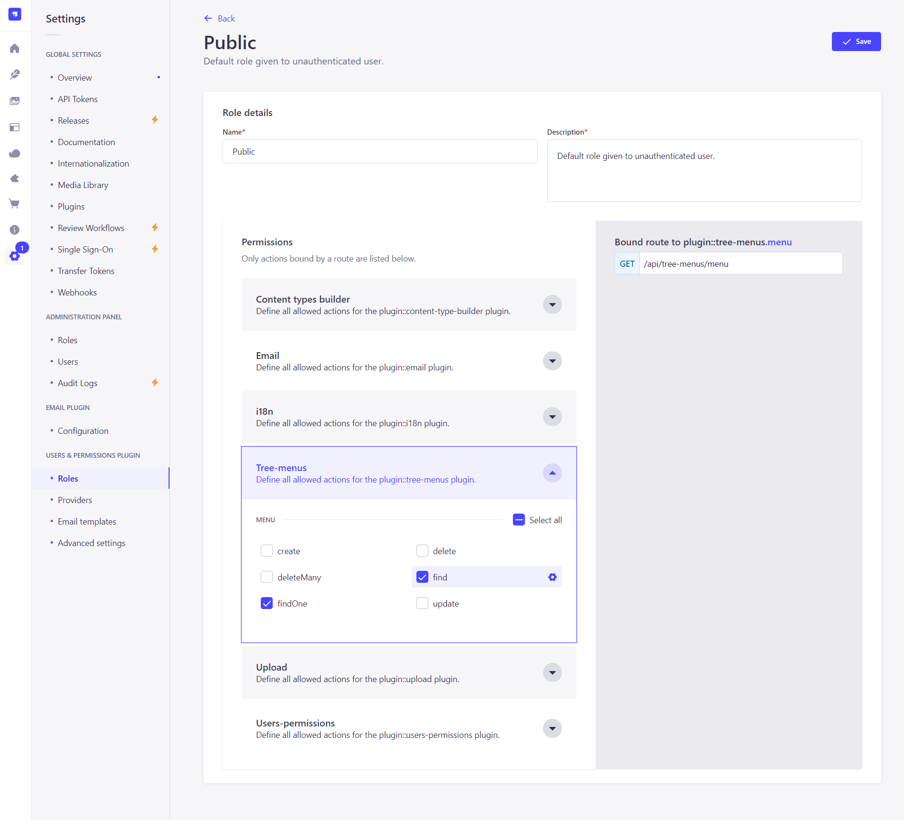

<div align="center">
  
  <h1>Strapi Menus</h1>
  <p>A plugin for Strapi CMS to customize the structure of menus and menu items.</p>
  
</div>

## Get Started

* [Features](#features)
* [Installation](#installation)
* [Configuration](#configuration)
* [Extending](#extending)
* [User Guide](#user-guide)
* [API Usage](#api-usage)
* [Troubleshooting](#troubleshooting)
* [Support or Donate](#donate)
* [Roadmap](#roadmap)
* [Gallery](#gallery)

## <a id="features"></a>✨ Features
* Consumable menu data which can be used to render navigation and other menus in a frontend app.
* Easily manage menus with either a flat or nested structure.
* Customize the `title`, `url`, `isProtected`, and link `target` of menu items.
* Extend the schema and UI with custom attributes for menu items.
* Support for all Strapi field types in the UI.
* Support i18n translations for menu attributes.

## <a id="installation"></a>💎 Installation
```bash
yarn add strapi-plugin-tree-menus@latest
```

Don't forget to **restart or rebuild** your Strapi app when installing a new plugin.

## <a id="configuration"></a>🔧 Configuration
| property | type (default) | description                                              |
| - | - |----------------------------------------------------------|
| fieldSchema | object (`{}`) | Schema for menu items.                     |

### `fieldSchema`
The `fieldSchema` prop is an object that defines the schema for menu items. This is where you can add custom attributes to the `MenuItem` schema. The example below demonstrates how to add a custom `example_field` attribute to the `MenuItem` schema.


#### Example

```js
// ./config/plugins.js`
'use strict';

module.exports = {
  menus: {
    config: {
      fieldSchema: {
        attributes: [
          {
            id: "title",
            label: "Title",
            placeholder: "Enter item title",
            type: "text",
            validationType: "string",
            value: "New items",
            required: true,
            validations: [
              {
                type: "required",
                params: ["this field is required"]
              },
              {
                type: "max",
                params: [100, "Title cannot be more than 100 characters"]
              },
              {
                type: "default",
                params: ["New items"]
              }
            ]
          },
          {
            id: "url",
            label: "Url",
            placeholder: "Enter url",
            type: "text",
            validationType: "string",
            value: "/",
            required: true,
            validations: [
              {
                type: "required",
                params: ["this field is required"]
              },
              {
                type: "max",
                params: [200, "Url cannot be more than 200 characters"]
              },
              {
                type: "default",
                params: ["/"]
              }
            ]
          },
          {
            id: "target",
            label: "Target",
            placeholder: "Enter target",
            type: "select",
            validationType: "mixed",
            value: '_self',
            required: true,
            validations: [
              {
                type: "oneOf",
                params: [['_blank', '_parent', '_self', '_top'], "this field needs to be one of the following: _blank, _parent, _self, _top"]
              },
              {
                type: "default",
                params: ['_self']
              }
            ],
            options: [
              {
                key: "_blank",
                value: "_blank",
                metadatas: {
                  intlLabel: {
                    id: "tree-menus.target.options._blank",
                    defaultMessage: "New window (_blank)"
                  },
                  disabled: false,
                  hidden: false
                }
              },
              {
                key: "_parent",
                value: "_parent",
                metadatas: {
                  intlLabel: {
                    id: "tree-menus.target.options._parent",
                    defaultMessage: "Parent window (_parent)"
                  },
                  disabled: false,
                  hidden: false
                }
              },
              {
                key: "_self",
                value: "_self",
                metadatas: {
                  intlLabel: {
                    id: "tree-menus.target.options._self",
                    defaultMessage: "Same window (_self)"
                  },
                  disabled: false,
                  hidden: false
                }
              },
              {
                key: "_top",
                value: "_top",
                metadatas: {
                  intlLabel: {
                    id: "tree-menus.target.options._top",
                    defaultMessage: "Top window (_top)"
                  },
                  disabled: false,
                  hidden: false
                }
              }
            ]
          },
          {
            id: "isProtected",
            label: "isProtected",
            placeholder: "Choose isProtected",
            type: "bool",
            validationType: "boolean",
            value: false,
            required: true,
            validations: [
              {
                type: "required",
                params: ["Need to choose isProtected"]
              },
              {
                type: "default",
                params: [false]
              }
            ]
          }
        ]
      },
    },
  },
};
```


### Enable menus in Documentation plugin
Default Strapi documentation included the `tree-menus` documentation.




### Supported field types
The following field types in the table below are supported. Some fields use a different type value for the schema and input type.

| Field | Schema Type | Input Type |
| - | - | - |
| Boolean | `boolean` | `bool` |
| Date | `date`, `time`, `datetime` | same |
| Email | `email` | same |
| Enumeration | `enumeration` | `select` |
| Media | `media` | same |
| Number | `integer`, `biginteger`, `decimal`, `float`  | `number` |
| Password | `password` | same |
| Rich Text | `richtext` | `wysiwyg` |
| Text | `string`, `text` | `string`, `text`, `textarea` |

The following field types are **NOT** supported:
* Component
* Dynamic Zone
* UID
* JSON

> **NOTE:** By default, **rich text fields** are not supported unless a custom plugin overrides the core **WYSIWYG** editor, which is covered in the [Strapi guide to creating a new WYSIWYG field in the admin panel](https://docs.strapi.io/developer-docs/latest/guides/registering-a-field-in-admin.html).

## <a id="user-guide"></a>📘 User Guide

### Create
On the menus plugin home page, use the "Create new menu" button to get started. You will need to provide a `title` and a unique `slug` value for the new menu. Saving the menu before adding menu items is **recommended** but not required.

### Clone
Choosing to clone an existing menu will take you to the edit view as usual, but this time it will be pre-populated with another menu's data. Once the cloned menu is saved, a brand new menu and menu items are created.

### Delete
Deleting a menu will also delete all of it's menu items.

### Edit
When clicking on a menu item in the left column, it will reveal action buttons to move the item, delete it, or give it a submenu.

The right column will reveal the edit UI for that item, where the `title` is the only required field.

## <a id="api-usage"></a>⚡ API Usage
Fetching menus data is the same as fetching any other data using Strapi's REST API features.

> **Don't forget** to enable the public methods for `Menu` and `MenuItem` in the Users and Permissions settings, like `find` and `findOne`.



### Endpoints
| request  | endpoint                           | description       |
|----------|------------------------------------|-------------------|
| `GET`    | `/api/tree-menus/menu`             | Fetch all menus.  |
| `GET`    | `/api/tree-menus/menu/:id`         | Fetch one menu.   |
| `POST`   | `/api/tree-menus/menu/:id`         | Create a menu.    |
| `PUT`    | `/api/tree-menus/menu/:id`         | Update a menu.    |
| `DELETE` | `/api/tree-menus/menu/:id`         | Delete a menu.    |
| `POST`   | `/api/tree-menus/menu/bulk-delete` | Delete many menu. |


#### Basic example
Fetch a menu with the `documentId`. Nothing is populated by default.

```js
await fetch('/api/tree-menus/menu/${documentId}');
```

##### Response

```json
{
  "data": {
    "id": 1,
    "documentId": "jke4feqw23h1",
    "title": "Main Menu",
    "slug": "main-menu",
    "items": [
      {
        "id": "1",
        "title": "Home",
        "url": "/",
        "target": "_self",
        "isProtected": false,
        "children": []
      },
      {
        "id": "2",
        "title": "About",
        "url": "/about",
        "target": "_self",
        "isProtected": false,
        "children": [
          {
            "id": "2.1",
            "title": "Our Team",
            "url": "/about/our-team",
            "target": "_self",
            "isProtected": false,
            "children": []
          },
          {
            "id": "4",
            "title": "Our Mission",
            "url": "/about/our-mission",
            "target": "_self",
            "isProtected": false,
            "children": []
          }
        ]
      }
    ],
    "createdAt": "2024-10-07T08:00:00.000Z",
    "updatedAt": "2024-10-07T08:00:00.000Z",
    "publishedAt": "2024-10-07T08:00:00.000Z"
  },
  "meta": {}
}
```

## <a id="troubleshooting"></a>💩 Troubleshooting

#### In general
Remember to **rebuild your app** after making changes to some config or other code.

```bash
yarn build
# OR
yarn develop
```

#### Custom `MenuItem` attributes save in the schema or config.
If you are having trouble saving custom attributes in the `MenuItem` schema, make sure that the `fieldSchema` object is properly configured in the `config/plugins.js` file.
`fieldSchema` only supports the following field types: `string`, `text`, `number`, `bool`, `select`, `date`, `time`, `datetime`, `email`.

#### I can't see config `fieldSchema` in the Strapi admin panel.
<Image src="public/screenshot_6.png" alt="Screenshot for Strapi menus plugin" />

## <a id="donate"></a>❤️ Support or Donate
If you are enjoying this plugin and feel extra appreciative, you can [buy me a beer or 3 🍺🍺🍺](https://www.buymeacoffee.com/annh.dev).

<Image src="public/bmc_qr.png" width="200px" alt="Buy me a beer"/>

## <a id="roadmap"></a>🚧 Roadmap

## <a id="gallery"></a>📸 Gallery
<Image src="public/screenshot_1.png" alt="Screenshot for Strapi menus plugin" />
<Image src="public/screenshot_2.png" alt="Screenshot for Strapi menus plugin" />
<Image src="public/screenshot_3.png" alt="Screenshot for Strapi menus plugin" />
<Image src="public/screenshot_4.png" alt="Screenshot for Strapi menus plugin" />
<Image src="public/screenshot_5.png" alt="Screenshot for Strapi menus plugin" />
<Image src="public/screenshot_6.png" alt="Screenshot for Strapi menus plugin" />
<Image src="public/screenshot_7.png" alt="Screenshot for Strapi menus plugin" />
<Image src="public/screenshot_8.png" alt="Screenshot for Strapi menus plugin" />

